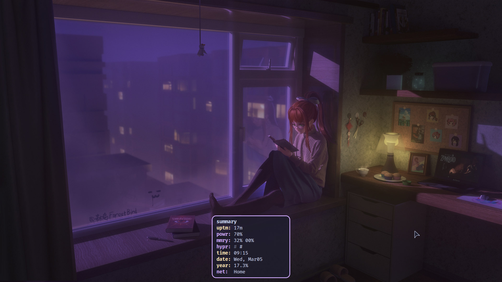
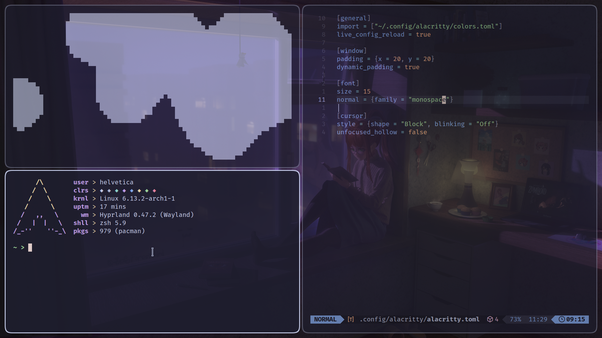

# dotfiles
personal **barless** daily-driver dotfiles based on [`hyprland`](https://hyprland.org/) and [Catppuccin](https://github.com/catppuccin/catppuccin)
> barless setup is achieved using a manually toggleable [`mako`](https://github.com/emersion/mako)-enabled summary notification, alongside other bind (hypr keybinds) toggleable notifications. previews are below for the different functions the scripts and binds could provide

## previews
### video

https://github.com/user-attachments/assets/81408b9b-da0c-4f00-9b25-48e4131bf957

### screenshots

---

## Packages/Dependencies Used
### hyprland and co. (major UI elements)
- wm: [`hyprland`](https://hyprland.org/), complete with ~almost~ all hypr ecosystem tools: `hyprpaper`, `hyprpicker`, `hypridle`, `hyprlock`, and `hyprcursor`
- notification (and [scripts](bin/) carrier): [`mako`](https://github.com/dunst-project/dunst) with scripts ([summary](bin/summary), alongside [workspaces](bin/summaryhypr) and [yearprogress](bin/yearprogress) as parts of summary) for the toggleable summary notification. rest of notifications and scripts are either configured as their own [bin scripts](bin/) or directly as binds in [`hypr` config](.config/hypr/hyprland.conf)
- app launcher: [`tofi`](https://github.com/philj56/tofi) with [config](.config/tofi/config) designed to mimic mako config inplace

### extra dependencies for config (i use, feel free to use alternatives :) )
`clipman` and `wl-clipboard` (for copying and pasting), `brightnessctl` `playerctl` `pamixer` (audio/brightness binds), [`sway-audio-idle-inhibit`](https://github.com/ErikReider/SwayAudioIdleInhibit) for togglable & in audio idle inhibitor, `grim` and `grimshot` (for screenshots), `cron` and `udev` for [low battery](bin/battery-alert) and [charging](bin/battery-charging) alert scripts (from [Eric Murphy's dotfiles' scripts](https://github.com/ericmurphyxyz/dotfiles/tree/master/.local/bin))

### terminal/shell stuff
- terminal: [`alacritty`](https://github.com/alacritty/alacritty)
- shell: `zsh`, modified with [`starship`](https://github.com/starship/starship) and a few plugins and modifications ([`zsh-autosuggestions`](https://github.com/zsh-users/zsh-autosuggestions), [`zsh-syntax-highlighting`](https://github.com/zsh-users/zsh-syntax-highlighting), [`zsh-shift-select`](https://github.com/jirutka/zsh-shift-select))
- text editor: [`nvim`](https://github.com/neovim/neovim) with [LazyVim](https://github.com/LazyVim/LazyVim) based config (not in dotfiles)
- fetch: [`fastfetch`](https://github.com/fastfetch-cli/fastfetch)
- animation: [`lavat`](https://github.com/AngelJumbo/lavat)

### theming stuff and miscellaneous
- theme: [Catppuccin](https://github.com/catppuccin/catppuccin)
- wallpaper: [pixiv link](https://www.pixiv.net/en/artworks/95800226)
- font: [Fira Code](https://github.com/tonsky/FiraCode)
