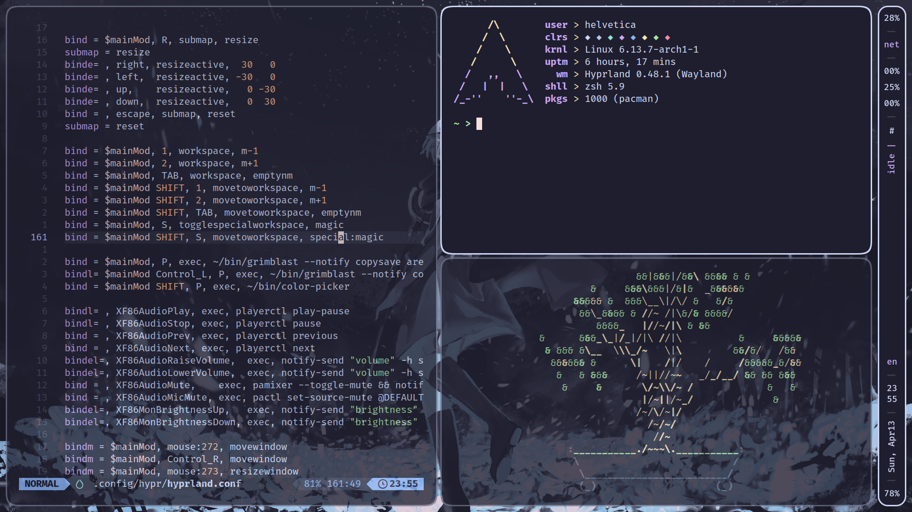

# dotfiles

personal daily-driver dotfiles (with vertical bar) based on [`hyprland`](https://hyprland.org/) and [Catppuccin](https://github.com/catppuccin/catppuccin)

## previews

> usual terminal grid showcase, idle inhibitor active in bar

> spotify showcase, music progress active in bar, volume progress bar notification

> tofi bar showcase

## packages/dependencies used (based on dotfiles hierarchy)

### `~/.config/`

| path | packages | need |
| :---: | :---: | --- |
| [`alacritty/`](.config/alacritty) | [`alacritty`](https://github.com/alacritty/alacritty) | terminal emulator |
| [`fastfetch/`](.config/fastfetch) | [`fastfetch`](https://github.com/fastfetch-cli/fastfetch) | fetch tool |
| [`hypr/`](.config/hypr) | [`hyprland`](https://hyprland.org/)   `hyprpaper`   `hyprpicker`   `hypridle`   `hyprlock`   `hyprcursor` | [hyprland](https://hyprland.org/)   with ~almost~ all hypr ecosystem tools |
| [`mako/`](.config/mako) | [`mako`](https://github.com/emersion/mako) | notification daemon |
| [`spicetify/`](.config/spicetify) | [`spicetify`](https://github.com/Alexays/Waybar) | vertical bar |
| [`tofi/`](.config/tofi) | [`tofi`](https://github.com/philj56/tofi) | bar-like app launcher |
| [`waybar/`](.config/waybar) | [`waybar`](https://github.com/Alexays/Waybar) | vertical bar |

### `~/.zsh`

| path | packages | need |
| :---: | :---: | --- |
| [`.zshrc`](.zsh/.zshrc)/ [`~/.zshrc`](.zshrc) (symlink) | [`zsh`](https://www.zsh.org/) | shell |
| [`starship/`](.zsh/starship) | [`starship`](https://github.com/starship/starship) | shell niceties/theme/"prompt" |
| `plugins/` ([ignored](.gitignore)) | [`zsh-autosuggestions`](https://github.com/zsh-users/zsh-autosuggestions)  [`zsh-syntax-highlighting`](https://github.com/zsh-users/zsh-syntax-highlighting) [`zsh-shift-select`](https://github.com/jirutka/zsh-shift-select) | plugins for zsh theme |

### `~/bin/` (scripts in use)

| script | need |
| :---: | --- |
| [`battery-alert`](bin/battery-alert) | notifications at different battery levels (dependent on a [`cron`](https://en.wikipedia.org/wiki/Cron)job, from [Eric Murphy's dotfiles' scripts](https://github.com/ericmurphyxyz/dotfiles/tree/master/.local/bin)) |
| [`battery-charging`](bin/battery-charging) | notifications when connecting and disconnecting charger (dependent on [`udev`](https://en.wikipedia.org/wiki/Udev) rules, from [Eric Murphy's dotfiles' scripts](https://github.com/ericmurphyxyz/dotfiles/tree/master/.local/bin)) |
| [`color-picker`](bin/color-picker) | notification showing current color after executing `hyprpicker` (modifies [`mako` config file](.config/mako/config) directly) |
| [`grimblast`](bin/grimblast) | [grimshot (easy screenshots) for hyprland](https://github.com/hyprwm/contrib/tree/main/grimblast) |
| [`musicstring`](bin/musicstring) | json for playerctl enabled pseudo-progress bar in waybar  (css hack, adapting [this script I found](https://web.archive.org/web/20201111230445/https://ix.io/1RBN) from [this Reddit comment](https://www.reddit.com/r/unixporn/comments/cq5gm5/comment/ewu2fkb/?utm_source=share&utm_medium=web3x&utm_name=web3xcss&utm_term=1&utm_content=share_button)) |
| [`gradientgen`](bin/gradientgen) | css style generator (in [`waybar`](~/.config/waybar)'s [`style.css`](.config/waybar/style.css)) for the [`musicstring`](bin/musicstring) script |
| [`summaryclock`](bin/summaryclock) | notification sent every hour on ##:00   (dependent on a [`cron`](https://en.wikipedia.org/wiki/Cron)job) |
| [`yearprogress`](bin/yearprogress) | year percentage for [`waybar`](~/.config/waybar) |

### config dependencies

> the not so obvious ones unlike `systemd` or `libnotify` **for Arch Linux**

| package(s) | need |
| :---: | --- |
| `wl-clipboard` | clipboard |
| `brightnessctl` `playerctl` `pamixer` | audio/brightness binds in [`hyprland`](.config/hypr/hyprland.conf) |
| [`sway-audio-idle-inhibit`](https://github.com/ErikReider/SwayAudioIdleInhibit) | audio idle inhibitor |
| `grim` `slurp` `jq` | requirements for [`grimblast`](bin/grimblast) |
| [`nwg-look`](https://github.com/nwg-piotr/nwg-look) | GTK, icon, and cursor theming |

### theming (and extras)

| item | description |
| :---: | --- |
| [catppuccin](https://github.com/catppuccin/catppuccin) | theme  (flavor: Mocha Mauve)  |
| [wallpaper](.config/hypr/wallpaper.png) | [original wallpaper (pixiv)](https://www.pixiv.net/en/artworks/95800226) modified using [`gowall`](https://github.com/Achno/gowall?tab=readme-ov-file) |
| [Fira Code](https://github.com/tonsky/FiraCode) | font |
| [cbonsai](https://gitlab.com/jallbrit/cbonsai) | bonsai terminal illustration |
